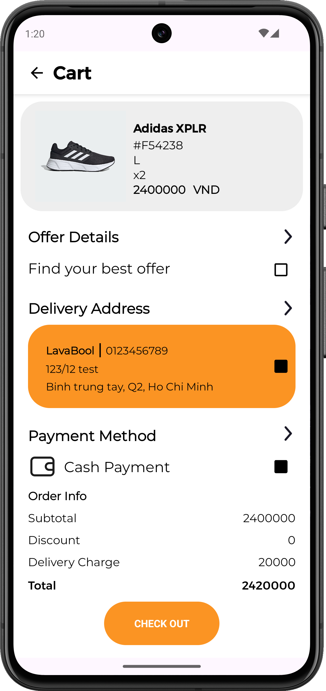

# SHOPPER - Solution for small clothing store

## Overview

Welcome to **Shopper**, an intuitive and efficient online shopping application designed to enhance your shopping experience. Built using Android Studio and Java, Shopper provides a seamless platform for users, admins, and staff to interact and manage online store activities.

## Table of Contents

- [Features](#features)
- [Installation](#installation)
- [Usage](#usage)
- [User Roles](#user-roles)
- [Screenshots](#screenshots)
- [Contributing](#contributing)
- [License](#license)
- [Contact](#contact)

## Features

- **User-Friendly Interface**: Intuitive and easy-to-navigate interface for a smooth shopping experience.
- **Product Browsing**: Browse and search products with detailed descriptions and images.
- **Shopping Cart**: Add products to the shopping cart and manage them easily.
- **Order Management**: Place orders, track status, and view order history.
- **Admin Dashboard**: Manage products, view sales analytics, and handle user accounts.
- **Staff Interface**: Assist with order processing and customer service.

## Installation

To set up the Shopper app on your local machine, follow these steps:

1. **Clone the Repository**
    ```sh
    git clone https://github.com/bcluc/shopper.git
    ```
2. **Open in Android Studio**
    - Open Android Studio.
    - Select `File` -> `Open` and navigate to the cloned repository.

3. **Build the Project**
    - Ensure all dependencies are installed.
    - Sync the project with Gradle files.

4. **Run the Application**
    - Connect an Android device or start an Android emulator.
    - Click on the `Run` button in Android Studio.

## Usage

### User
- **Sign Up/Sign In**: Create an account or log in with existing credentials.
- **Browse Products**: Explore various categories and products, including trending items.
- **Product Details**: View detailed information and categories of products.
- **Search**: Search for specific products.
- **Notifications**: Receive notifications about new promotions and order updates.
- **Order History**: View past orders and track current ones.
- **Profile Management**: Change profile information and password; recover forgotten passwords.
- **Product Reviews**: Review products.
- **Favorites**: Add products to a favorites list.
- **Chat**: Chat with staff for support.
- **Place Orders**: Complete purchases by placing orders.

### Admin
- **Product Management**: Add, update, or remove products.
- **Category Management**: Create and manage product categories.
- **Order Management**: Confirm orders and view order statuses.
- **Promotions**: Push promotions to users.
- **User Management**: Manage user accounts and view user activities.
- **Staff Management**: Manage staff members.
- **Sales Reports**: View detailed sales reports and analytics.
- **Customer Support**: Chat with customers and provide support.

### Staff
- **Product Management**: Add, update, or remove products.
- **Category Management**: Create and manage product categories.
- **Order Management**: Confirm orders and view order statuses.
- **Promotions**: Push promotions to users.
- **Customer Support**: Chat with customers and provide support.

## User Roles

### User
Regular customers can browse products, add them to the cart, and place orders.

### Admin
Administrators with full access to manage products, view analytics, handle user accounts, manage staff, and view sales reports.

### Staff
Employees who assist with product and category management, order processing, promotions, and customer service.

## Screenshots

Here are some screenshots of our application. 


*Login Screen*


*Customer Dashboard*


*Detail Product*


*Shopping Cart*


*Checkout*


*Chat*


*Order Notifications*


*Staff Dashboard*


*Staff Orders*


*Admin Dashboard*


*Admin Manage*


*Admin Report*

## Contributing

We welcome contributions to improve the Shopper app! To contribute, follow these steps:

1. Fork the repository.
2. Create a new branch (`git checkout -b feature-branch`).
3. Commit your changes (`git commit -m 'Add some feature'`).
4. Push to the branch (`git push origin feature-branch`).
5. Open a Pull Request.

Please ensure your code adheres to our coding standards and includes appropriate tests.

## License

This project is licensed under the MIT License. See the [LICENSE](LICENSE) file for details.

## Contact

For any inquiries or feedback, please contact us at:

- Email: support@shopperapp.com
- GitHub: [https://github.com/bcluc/shopper.git](https://github.com/bcluc/shopper.git)

Thank you for using Shopper! We hope you enjoy your shopping experience.

---

**Shopper Team**
